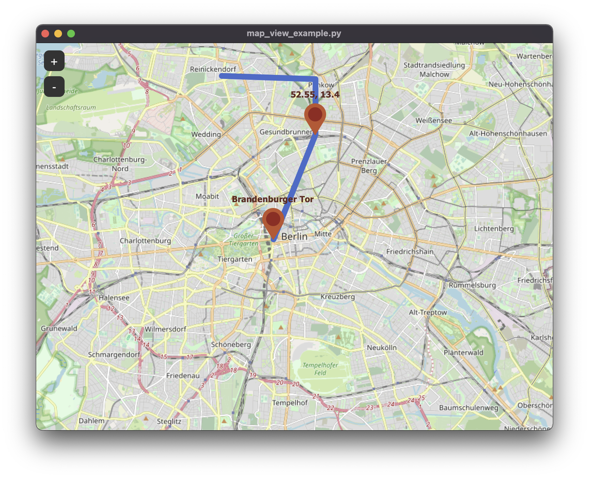

# TkinterMapView widget



TkinterMapView is a tile based map renderer widget for the python Tkinter library.
By default, it displays the OpenStreetMap map, but you can change the tile server to
whatever you like, and it also supports a second tile server for overlays like OpenSeaMap.
You can set the current focus of the widget by a position or address, and place markers 
or a path on the map.

The above image program is produced by the following code example (`map_view_simple_example.py`):

````python
import tkinter
from tkinter_map_widget import TkinterMapWidget

# create tkinter window
root_tk = tkinter.Tk()
root_tk.geometry(f"{800}x{600}")
root_tk.title("map_view_example.py")

# create map widget
map_widget = TkinterMapWidget(root_tk, width=800, height=600, corner_radius=0)
map_widget.place(relx=0.5, rely=0.5, anchor=tkinter.CENTER)

# set other tile server (standard is OpenStreetMap)
# map_widget.set_tile_server("https://mt0.google.com/vt/lyrs=m&hl=en&x={x}&y={y}&z={z}&s=Ga", max_zoom=22)  # google normal
# map_widget.set_tile_server("https://mt0.google.com/vt/lyrs=s&hl=en&x={x}&y={y}&z={z}&s=Ga", max_zoom=22)  # google satellite

# set current widget position and zoom
map_widget.set_position(52.516268, 13.377695, marker=False)  # Berlin, Germany
map_widget.set_zoom(17)

# set current widget position with address
map_widget.set_address("Berlin Germany", marker=False)

# set a position marker
marker_2 = map_widget.set_marker(52.516268, 13.377695, text="Brandenburger Tor")
marker_3 = map_widget.set_marker(52.55, 13.4, text="52.55, 13.4")
# marker_3.set_position(...)
# marker_3.set_text(...)
# marker_3.delete()

# set a path
path_1 = map_widget.set_path([marker_2.position, marker_3.position, (52.57, 13.4), (52.55, 13.35)])
# path_1.add_position(...)
# path_1.remove_position(...)
# path_1.delete()

root_tk.mainloop()
````